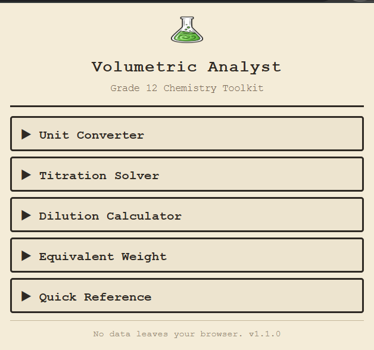
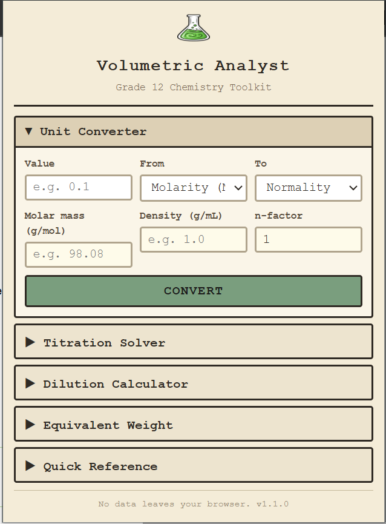
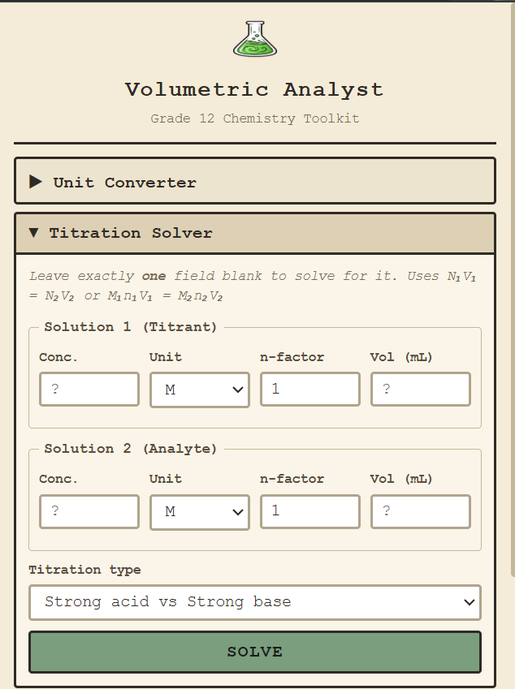
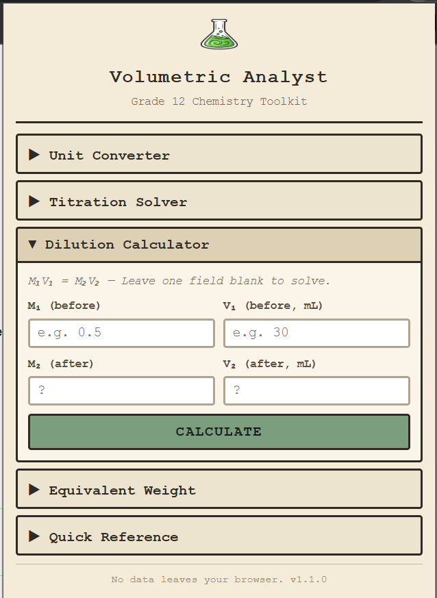
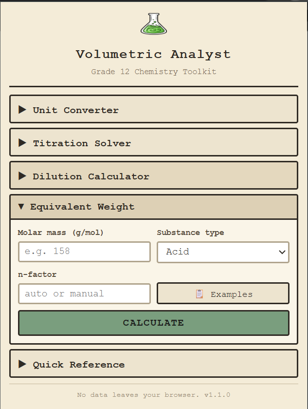
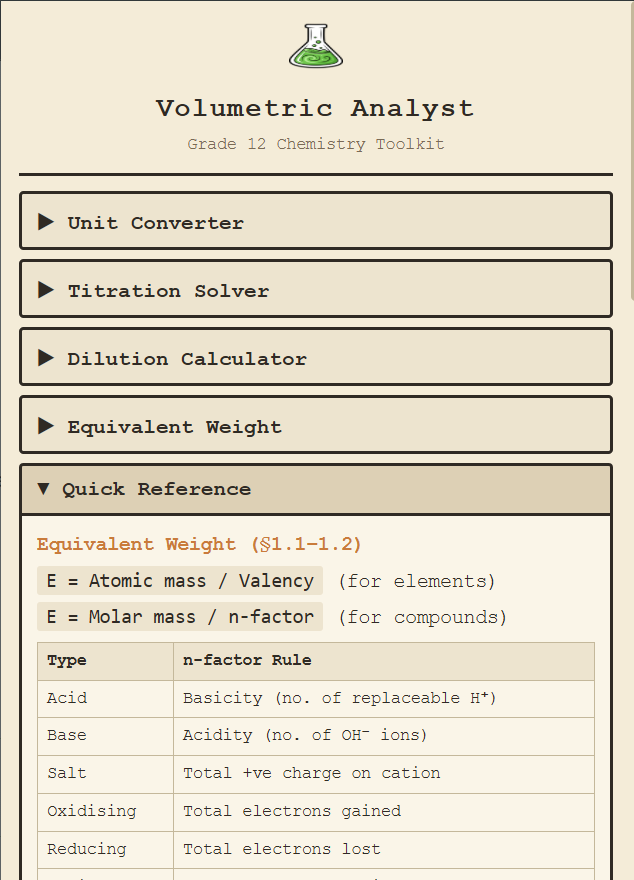

# Volumetric Analyst

A Chrome extension for Grade 12 Chemistry students covering concentration unit conversion, titration solving, dilution calculations, and equivalent weight computation.

---

## Features

| Section | What it does |
|---|---|
| **Unit Converter** | Convert between M, N, F, g/L, % (w/v), % (w/w), % (v/v), ppm, ppb, and molality |
| **Titration Solver** | Solve N₁V₁ = N₂V₂ for acid-base and redox titrations (permanganometry, dichromatometry, iodometry) with step-by-step working |
| **Dilution Calculator** | M₁V₁ = M₂V₂ with "water to add" helper |
| **Equivalent Weight** | Calculate eq. wt. for acids, bases, salts, oxidising/reducing agents, elements, and radicals |
| **Quick Reference** | Syllabus-aligned formulas, primary/secondary standards, and indicator pH ranges |

---

|  |  |
|-----------------------------------------------|--------------------------------------------------|
|  |  |
|  |  |

---

## License 
Made for hack club
